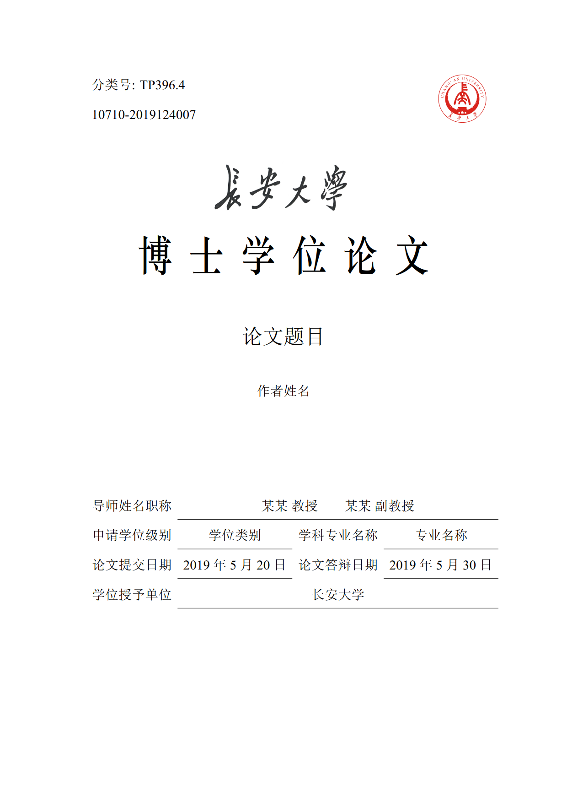
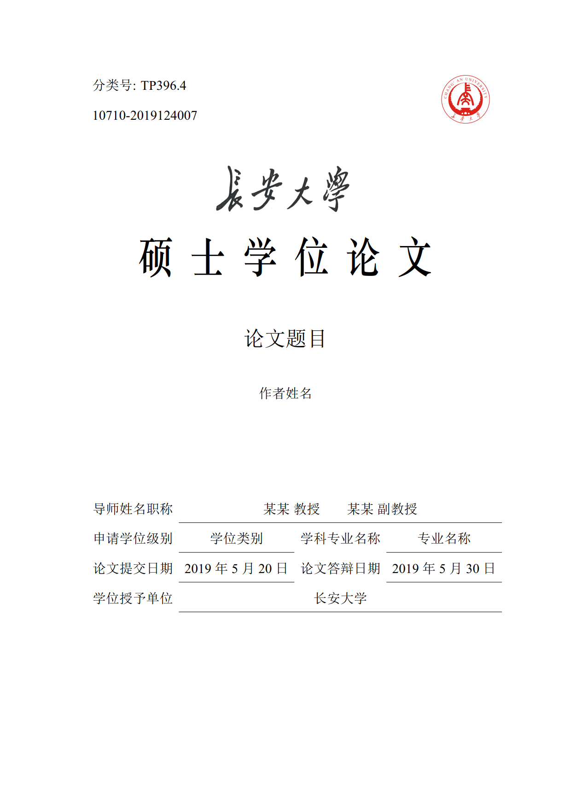
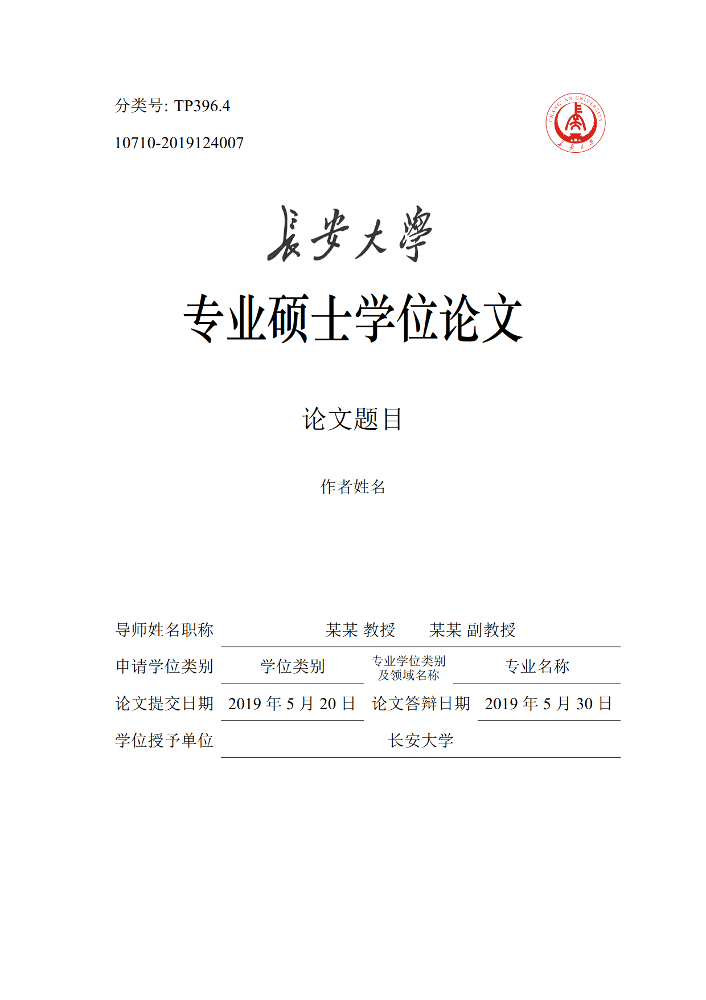

# 长安大学研究生学位论文 LaTeX 模板

本项目 Fork 自 [chdthesis](https://github.com/xiaoleeza/chdthesis) 项目，感谢 xiaoleeza 同学。

原模板 chinathesis 已经停止维护，改为 [ustcthesis（中国科学技术大学学位论文 LaTeX 模板）](https://github.com/ustctug/ustcthesis)。因此基于新的 ustcthesis 对 chdthesis 进行升级改造，感谢zepinglee同学。

本项目是长安大学的研究生学位论文 LaTeX 模板 chdthesis，按照《[长安大学研究生学位论文撰写规范](https://xxgk.chd.edu.cn/_mediafile/zerui87/2014/10/20/2opzjtyy3y.pdf)》的要求编写，兼容最新版的 TeX Live、MacTeX 、MiKTeX 发行版，支持跨平台使用。

包含专业型硕士、学术型硕士和博士三个选项，本科模板与研究生格式相差较大，可以使用 xiaoleeza 同学提供的[模板](https://github.com/xiaoleeza/chdpaper)。

使用方法与 ustcthesis 基本一致，下面贴出原项目注意：

1. 使用说明文档 `ustcthesis-doc.pdf` 在发布版中附带，用户也可自行编译；**使用模板前应仔细阅读**。

2. 本模板要求 TeX Live、MacTeX、MiKTeX 不低于 2017 年的发行版，
并且尽可能升级到最新。安装和升级方法见
[新手指南](https://github.com/ustctug/ustcthesis/wiki/新手指南)。

3. **不支持** [CTeX 套装](https://github.com/ustctug/ustcthesis/wiki/常见问题#3-模板支持用-ctex-套装编译吗)。





## 编译文档

- 编译论文 `main.pdf`：

   ```
   latexmk -xelatex main.tex
   ```

- 如需清理论文编译过程中的临时文件，可以：

   ```
   latexmk -c
   ```

- 以上编译过程也可以用 `make` 工具：

   ```
   make doc        # 编译生成 ustcthesis-doc.pdf
   make            # 编译生成论文 main.pdf
   make clean      # 删除编译过程中生成的临时文件
   ```

## 反馈问题

如果发现模板有问题，请按照以下步骤操作：

1. 阅读学校的标准，判断是否符合学校的要求；
2. 阅读 [常见问题 FAQ](https://github.com/ustctug/ustcthesis/wiki/常见问题)；
3. 将 TeX 发行版和宏包升级到最新，并且将模板升级到 Github 上最新版本，
查看问题是否已经修复；
4. 在 [GitHub Issues](https://github.com/xiaoleeza/chdthesis/issues)
中搜索该问题的关键词；
5. 在 [GitHub Issues](https://github.com/xiaoleeza/chdthesis/issues)
中提出新 issue，并回答以下问题：
    - 使用了什么版本的 TeX Live / MacTeX / MiKTeX ？
    - 具体的问题是什么？
    - 正确的结果应该是什么样的？
    - 是否应该附上相关源码或者截图？

如果导师或者院系在格式上有额外的要求，请将老师的邮件转发给模板作者。
作者会考虑增加接口以便修改格式。

### 免责声明

1. 本模板的发布遵守 LATEX Project Public License，使用前请认真阅读协议内容。

2. 本模板创立参照官方严格的论文写作手册，并同时参照硕士 / 博士学位论文doc文档对比修改。

3. 长安大学对论文写作提供写作指南与官方doc模板，本模板的出发点是方便大家使用专业的高效的论文书写工具，其重点在于注重排版质量、命令规范、使用方便、更新及时，符合论文撰写说明。但任何由于使用本模板而引起的论文格式审查问题均与本模板作者无关。

4. 欢迎提出修改意见。

### qq交流群

长安大学CHD LaTeX交流群 78437328
LaTeX技术交流 1 群 91940767
